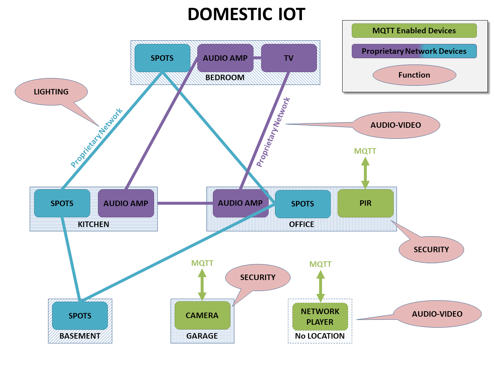
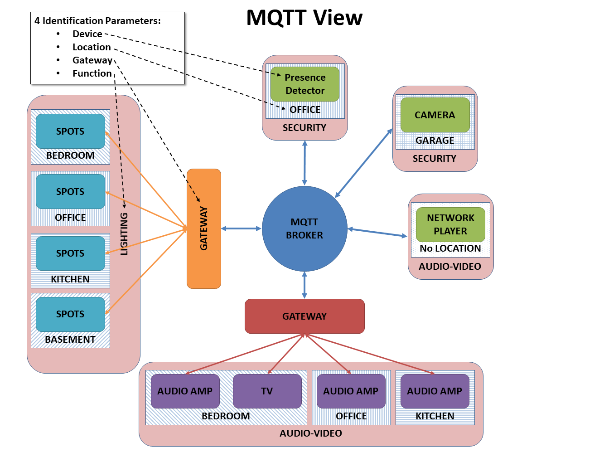

Concepts
========

The message model
*****************

The primary use case for this project is a domestic environment
with multiple devices of any type: lights, audio video components,
security devices, heating, air conditioning, controllers, keypads, etc...
For many (good) reasons, MQTT has been selected as the communication
protocol. But only a few, if any, devices are MQTT enabled.  Even for
those devices that communicate natively through MQTT, agreeing on a
syntax that make them exchange messages coherently is not easy.

Example
-------

In the example below, our smart home has some lighting connected
in four different rooms through a proprietary network, four audio-video
devices connected through another proprietary network, and some
other devices that are already MQTT-enabled, but which still need
to speak a common language. 

One of the objectives of this project is not only to define a common
MQTT syntax, but also to make it as *intuitive* as possible.  Ideally,
a human should be able to write a MQTT message off-hand and operate
successfully any device in the network.

Message Addressing
------------------

The first step of any message is to define its destination.  A flexible
addressing model should allow for a heuristic approach based on a
combination of characteristics of the recipient, on top of the
standard deterministic approach (e.g. a unique device id).
Four characteristics are usually considered:

- the **function** of the device: lighting, security, audio-video, etc;
- its **location**;
- its **gateway**: which application is managing that device, if any;
- the name of the **device**.

In our example, a MQTT view shows how those four characteristics
define all the devices in the network. The 2 gateways are also added.

Some considerations about those four characteristics:

- not all four characteristics need to be provided to address succesfully
  a device;
- the **device** name can be generic (e.g. ``spotlight``) or specific and unique
  within the network (e.g. ``lightid1224``); in the generic case, obviously
  other characteristics are needed to address the device.
- any device can have more than one value for each characteristics,
  particularly the **function**  and **device** ones (it is unlikely
  for the **gateway** and **location** characteristics);
- the **location** is important and probably the most intuitive characteristic
  of all; preferably it should represent the place where the device
  operates and not where it is physically located (e.g. an audio amplifier
  might be in the basement but it powers speakers in the living room;
  the location should be the living room); the location might even not be
  defined (e.g. to address the security system of the house, or an audio
  network player that can broadcast to multiple channels).
- the **gateway** is the most deterministic characteristic (alongside a unique
  device id); this should be the chosen route for fast and unambiguous
  messaging.
- the **function** is another important intuitive characteristic; not only it
  helps in addressing devices (combined with a location for example), but
  it should also help to clarify ambiguous commands (``ON`` with ``lighting``
  or with ``audiovideo`` means different things). However things can get
  more complicated if a device has more than one function; this should be
  allowed, it is up to the gateway to make sure any ambiguity is resolved
  from the other characteristics.

Those four characteristics should ensure that the messaging model
is flexible enough to be heuristic or deterministic.  A gateway
will decide how flexible it wants to be.  If it has enough bandwidth,
it can decide to subscribe to all **lighting** messages and then parse
all messages received to check if they are actually addressed to it.
Or it can subscribe only to messages addressed specifically to itself
(through the gateway name), restricting access only to senders that
know the name of that gateway (arguably not a very intuitive option).

Message Content
---------------

The content of a message in the context of domestic IoT can be modelled
in many different ways.  This project splits it into 3 *characteristics*:

- a **type** with 2 possible values: *command* for messages that are requiring
  an action to be performed, or *status* for messages that only broadcast
  a state;
- an **action** that indicates what to do or what the status is, or is
  referring to;
- a set of **arguments** that might complete the **action** characteristic.

The key characteristic here is the **action**, a string that can represent
anything.  Indeed the message content could be limited to it if the string
contained all the information needed, like ``SWITCH_LIGHT_ON``,
``CHANGE_VOLUME_+4``, or ``REPORT_TEMPERATURE``.  However, separating
those 3 elements eases the processing of internal messages in the code.

Message Source
--------------

The sender, which can be a device or another gateway for example, is
an optional characteristic in our message model.  It can be very useful in
answering status requests in a targeted way, for example.

Bridging MQTT and the interface
*******************************

There are therefore a total of 8 characteristics in our message model:

- **function**,
- **gateway**,
- **location**,
- **device**,
- **type**,
- **action**,
- **argument** of action,
- **source**.

They are all strings except **type** which can only have 2 predefined values.
They are all the fields that can appear in a MQTT message, either in the topic
or in the payload.
They are all attributes of the internal message class that is used to exchange
messages between the core of the application (the *wrapper*) and the interface
being developed.
They are all the characteristics available to the developer to code its
interface.

The internal message class
--------------------------

The internal message class :class:`internalMsg` defines the objects stored
in the lists shared by the application core and the interface.
It is supposed to be the most useful representation of a message for the
interface code.  All that the framework does is parse MQTT messages into
internal ones, and back.  The framework therefore defines the MQTT syntax by
the way it `converts` the messages.

The conversion process
-----------------------

This conversion process happens inside the class :class:`msgMap` with the
methods :meth:`MQTT2Internal` and :meth:`Internal2MQTT`.  These methods
achieve 2 things:

- map the keywords for every characteristic between the MQTT *vocabulary* and
  the internal one; this is done via a simple dictionary initialised by a
  *mapping file*,
- define intrinsically the syntax of the MQTT messages in the way the various
  characteristics are positioned within the MQTT topic and payload.

The MQTT syntax
---------------

The topic is structured like this:

.. code-block:: none

	root/function/gateway/location/device/source/type

where ``root`` can be anything the developer wants (``home`` for example)
and ``type`` can be only ``C`` or ``S``.
	
The payload is simply the action alone if there are no arguments:

.. code-block:: none

	action_name
	
or the action with the arguments all in a JSON string like this:

.. code-block:: none

	{"action":"action_name","arg1":"value1","arg2":"value2",...}
	
where the first ``action`` key is written as is and the other argument keys
can be chosen by the developer and will be simply copied in the **argument**
dictionary.

The mapping data
----------------

The conversion between MQTT keywords and internal ones is based on a simple
one-to-one relationship table for each characteristic (all except
**type**) .  It ensures that whatever keyword is used in
the interface code is not affected by any change in the MQTT vocabulary.
For example, let's assume a location name in the MQTT vocabulary is ``basement``
and is related to the internal constant ``BASEMENT`` used inside the interface code.
If for some reason the name in the MQTT vocabulary needs to be changed to
``lowergroundfloor``, this can be done in the mapping table without touching the
interface code.  It is a minor feature but it helps to really separate the
MQTT world from the internal interface.

Currently the mapping data is provided by a JSON formatted file.  The JSON
schema ``mqtt_map_schema.json`` is available in the ``gateway`` package.
New JSON mapping files can be tested against this schema (I use the online
validation tool https://www.jsonschemavalidator.net/)
The mapping file also contains the topics to subscribe to and the root token
for all the topics.

As the schema shows, all the keyword types can (but do not have to) be mapped:
function, gateway, location, device, source, action, argument keys and
argument values.  However, to give more flexibility, there are 3 mapping
options available for each type:

- ``none``: the keywords are left unchanged, so there is no need to provide
  the mapping data;
- ``strict``: the conversion of the keywords go through a map, and any missing
  keyword raises an error, and the corresponding message is probably ignored;
- ``loose``: like ``strict`` except that missing keywords do not raise any error
  but are passed unchanged.
