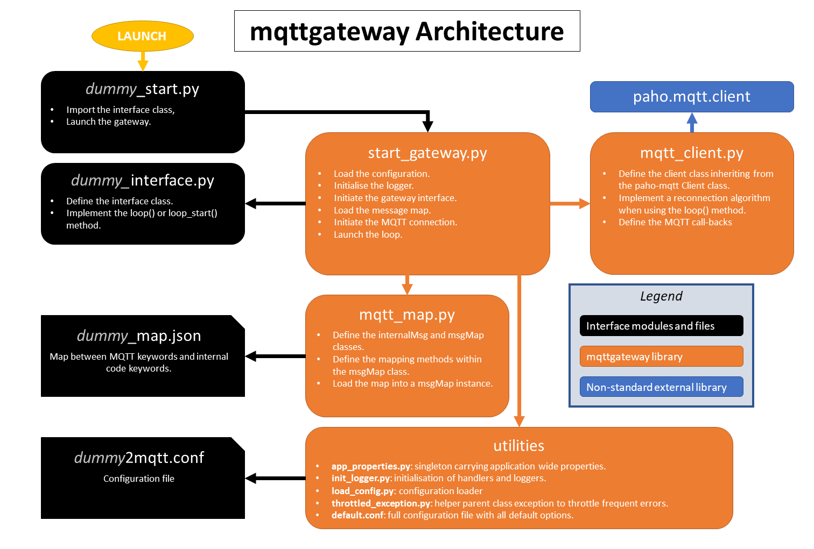
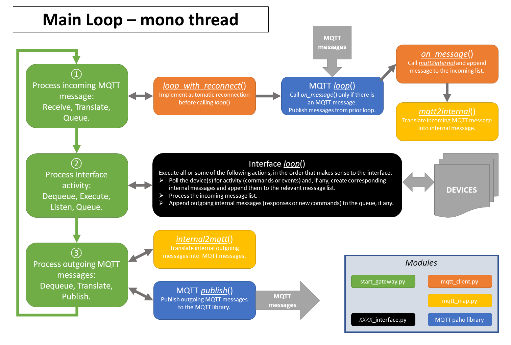
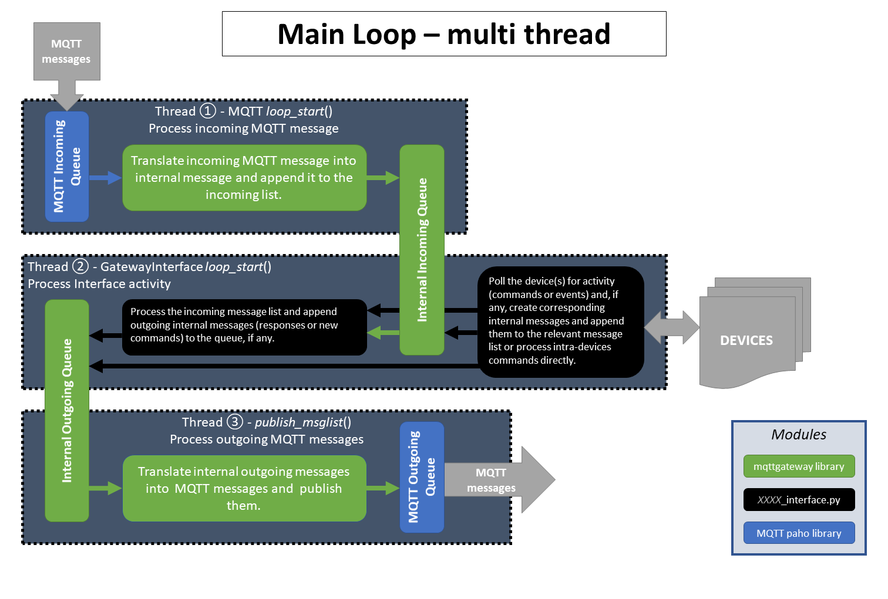

.. REVIEWED 9 November 2018

###########
Description
###########

The message model
=================

The primary use case for this project is a domestic environment
with multiple *connected* devices of any type
where MQTT has been selected as the communication transport.

For the devices that communicate natively through MQTT,
there is a need to agree on a syntax that makes the exchange of messages coherent.

For those devices that are not *MQTT enabled*,
there is a need to develop ad-hoc gateways to *bridge*
whatever interface they use natively (serial, Bluetooth, TCP...) to one
that is MQTT based.

This library addresses both requirements.

Example
-------

In the example below, a smart home has some lighting connected
in four different rooms through a proprietary network, four audio-video
devices connected through another proprietary network, and some
other devices that are already MQTT-enabled, but that still need
to speak a common language.

.. image:: domestic_iot.png
   :scale: 50%
   :align: center
   :alt: Diagram of a smart home with some connected devices

The first objective of this project is to define a common
MQTT syntax, and make it as *intuitive* as possible.  Ideally,
a human should be able to write an MQTT message off-hand and operate
successfully any device in the network.

Message Addressing
------------------

The first step of any message is to define its destination.  A flexible
addressing model should allow for a heuristic approach based on a
combination of characteristics of the recipient (for example its type and location),
instead of a standard deterministic approach (for example a unique device id).

A combination of these four characteristics cover those requirements:

- the **function** of the device: lighting, security, audio-video, etc;
- its **location**;
- its **gateway**: which application is managing that device, if any;
- the name of the **device**.

In our example, the MQTT point of view shows how those four characteristics,
or just a subset, can define all the devices in the network.

.. image:: iot_parameters.png
   :scale: 50%
   :align: center
   :alt: Diagram of a smart home from the MQTT network point of view

Some considerations about those four characteristics:

- not all four characteristics need to be provided to address succesfully
  a device;
- the **device** name can be generic (e.g. ``spotlight``) or specific and unique
  within the network (e.g. ``lightid1224``); if the generic case name is used,
  obviously other characteristics would be needed in the message
  to address the device.
- any device can *respond* to more than one value for some characteristics;
  for example a device could have more than one **function**:
  a connected light fitted with a presence sensor could have both ``lighting``
  and ``security`` functions.
- the **gateway** and a unique **device** id are the most deterministic
  characteristics and should be the choices for fast and unambiguous
  messaging.
- the **location** is probably the most intuitive characteristic;
  it should represent the place where the device
  operates and not where it is physically located (e.g. an audio amplifier
  might be in the basement but if it powers speakers in the living room then
  that should be its the location); but the location might even not be
  defined, for example for a house-wide security system, or an audio
  network player that can broadcast to different rooms.
- the **function** is another important intuitive characteristic; not only it
  helps in addressing devices, but
  it also clarifies ambiguous commands (e.g. ``POWER_ON`` with ``lighting``
  or with ``audiovideo`` means different things).

Those four characteristics should ensure that the messaging model
is flexible enough to be heuristic or deterministic.  A gateway
will decide how flexible it wants to be.  If it has enough processing bandwidth,
it can decide to subscribe to all **lighting** messages for example, and then parse
all messages received to check if they are actually addressed to it.
Or it can subscribe only to messages addressed specifically to itself
(through the gateway name for example), restricting access only to the senders that
know the name of that gateway.

Message Content
---------------

The content of a message is modelled in a standard way with those 3 elements:

- a **type** with 2 possible values: *command* for messages that are requiring
  an action to be performed, or *status* for messages that only broadcast
  a state;
- an **action** that indicates what to do or what the status is referring to;
- a set of **arguments** that might complete the **action** characteristic.

The key characteristic here is the **action**, a string representing the *what* to do,
with the optional **arguments** helping to define by *how much* for example.
It can be ``POWER_ON`` and ``POWER_OFF`` on their own for example (no argument), or
``SET_POWER`` with the argument ``power:ON`` or ``power:OFF``, or both.
The interface decides what actions it recognises.

Message Source
--------------

The sender, which can be a single device if it has direct access to the MQTT network
or a gateway, is another characteristic in this model.  It can be very useful in
answering status requests in a targeted way, for example.

Bridging MQTT and the interface
===============================

There are therefore a total of 8 characteristics in our message model:

- **function**,
- **gateway**,
- **location**,
- **device**,
- **type**,
- **action**,
- **argument** of action,
- **sender**.

They are all strings except **type** which can only have 2 predefined values.
They are all the fields that can appear in a MQTT message, either in the topic or in the payload.
They are all attributes of the internal message class that is used to exchange
messages between the library and the interface being developed.
They are all the characteristics available to the developer to code its interface.

The internal message class
--------------------------

The internal message class :py:class:`~mqttgateway.mqtt_map.internalMsg` defines
the message objects stored
in the lists that are shared by the library and the interface.
There is a list for incoming messages and a list for outgoing messages.
At its essence, the library simply parses MQTT messages into internal ones, and back.
The library therefore defines the MQTT syntax by the way it converts the messages.

The conversion process
-----------------------

The conversion process happens inside the class :py:class:`~mqttgateway.mqtt_map.msgMap`
with two methods to translate back and forth messages between MQTT and the internal message class.

These methods achieve 2 things:

- define the syntax of the MQTT messages in the way the various
  characteristics are positioned within the MQTT topic and payload;
- if mapping is enabled, map the keywords for every characteristic between
  the MQTT *vocabulary* and the internal one;
  this is done via dictionaries initialised by a *mapping file*.

The MQTT syntax
---------------

The library currently defines the MQTT syntax as follows.

The **topic** is structured like this:

.. code-block:: none

	root/function/gateway/location/device/sender/type

where ``root`` can be anything the developer wants (``home`` for example)
and ``type`` can be only ``C`` or ``S``.

The **payload** is simply the action alone if there are no arguments:

.. code-block:: none

	action_name

or the action with the arguments all in a JSON string like this:

.. code-block:: none

	{"action":"action_name","arg1":"value1","arg2":"value2",...}

where the first ``action`` key is written as is and the other argument keys
can be chosen by the developer and will be simply copied in the **argument**
dictionary.

This syntax is defined within the 2 methods doing the conversions.
The rest of the library is agnostic to the MQTT syntax.
Therefore one only needs to change these 2 methods to change the syntax.
However in that case, all the devices and other gateways obviously have to
adopt the same new syntax.

The mapping data
----------------

By default, when the mapping option is disabled, the keywords used in the MQTT messages
are simply copied in the internal class.
So, for example, if the **function** in the MQTT
message is ``lighting``, then the attribute ``function`` in the class
``internalMsg`` will also be the string ``lighting``.
If for any reason a keyword has to change on the MQTT *side* (maybe because a new device
is not flexible enough and imposes its own keywords), it would have to be reflected
in the code, which is unfortunate.  For example this new device, a connected bulb,
uses ``light`` as function and not ``lighting``, but ``lighting`` is now hard coded
in the interface.
In order for the interface to recognise this new keyword, a *mapping* can be introduced
that links the keyword ``light`` in the MQTT messages to ``lighting`` in the internal
representation of messages.  This mapping is defined in a separate JSON file,
and the code does not need to be modified.

The mapping option can be enabled (it is off by default) in the configuration file,
in which case the location of the JSON file is required.
All the keyword characteristics (except **type**) can (but do not have to) be mapped
in that file:
**function**, **gateway**, **location**, **device**, **sender**, **action**,
**argument keys** and **argument values**.

Furthermore, to give more flexibility, there are 3 mapping options available for each
characteristic that need to be specified:

- ``none``: the keywords are left unchanged, so there is no need to provide
  the mapping data for that characteristic;
- ``strict``: the conversion of the keywords go through the provided map,
  and any missing keyword raises an exception;
  the message with that keyword is probably ignored;
- ``loose``: the conversion of the keywords go through the provided map,
  but missing keywords do not raise any error and are passed unchanged.

The mapping between internal keywords and MQTT ones is a one-to-many relationship
for each characteristic.
For each internal keyword there can be more than one MQTT keyword,
even if there will have to be one which has *priority* in order to define without
ambiguity the conversion from internal to MQTT keyword.
In practice, this MQTT keyword will be the first one in the list provided in the
mapping (see below) and the other keywords of that list can be considered *aliases*.

Going back to the example above, for the unique internal function
keyword ``lighting``, we would define a list of MQTT keywords as
``["light", "lighting"]``, so that ``lighting`` in internal code gets converted
to ``light`` in MQTT (as it is the new *priority* keyword) but ``lighting`` in
MQTT is still accepted as a keyword that gets *converted* to ``lighting``
in internal messages.

The mapping data is provided by a JSON formatted file.
The JSON schema ``mqtt_map_schema.json`` is available in the ``gateway`` package.
New JSON mapping files can be tested against this schema (I use the online
validation tool https://www.jsonschemavalidator.net/)

The mapping file also contains the topics to subscribe to and the root token
for all the topics.  These values override the ones found in the configuration file
if the mapping feature is enabled.

Application structure
=====================

The ``mqttgateway`` package contains all the files needed to run a full application,
in this case the ``dummy2mqtt`` application.

The files related to the implementation of the ``dummy`` interface are:

-  ``dummy_start.py``: the launcher script; call this script to launch the application.
- ``dummy_interface.py``: the module that defines the class and methods called by the
  ``mqttgateway`` library to actually run the interface.
- ``dummy2mqtt.conf``: the configuration file for the dummy interface, compulsory.
- ``dummy_map.json``: the mapping file, optional.

The files exclusively related to the library are:

- ``start_gateway.py``: the main module of the library, it configures the application,
  initialise the interface and the MQTT connection, and launches the loop(s).
- ``mqtt_client.py``: the internal MQTT class, inherited from the ``paho-mqtt`` library,
  defines the algorithm to reconnect automatically when using the ``loop()`` method.
- ``mqtt_map.py``: defines the internal message class, the maps and their methods, and
  loads the maps if any.
- ``app_properties.py``: utility, defines a singleton with application-wide
  properties.
- ``load_config.py``: utility, loads the configuration from a file.
- ``init_logger.py``: utility, initialise handlers and loggers.
- ``default.conf``: file with all the configuration options and their defaults.
- ``mqtt_map_schema.json``: JSON schema to check the mapping files.

