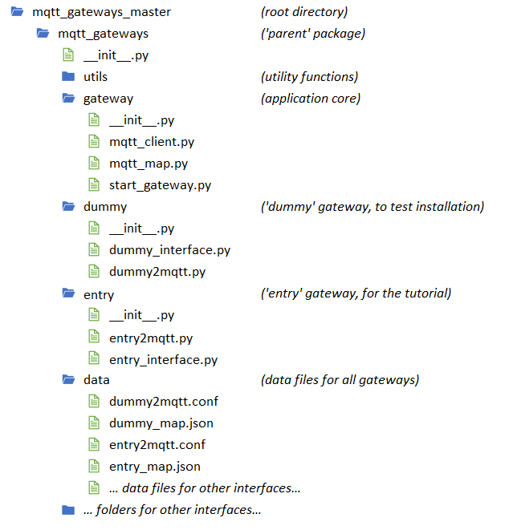

Installation
============

Copying the repository
**********************

To install this application just copy the
`github repository <https://github.com/ppt000/mqtt_gateways>`_ on your machine.
More precisely:

If you use a command-line only linux system:

- change directory to the location you want this application to be.  It could go under ``/usr/local/bin/`` for example,
  or your home directory ``/home/your_username/``.  Let's call this directory ``app_dir/`` for future reference.

- download the zipped file from GitHub, unzip it and delete it:

.. code-block:: none

    wget http://github.com/ppt000/mqtt_gateways/archive/master.zip
    unzip master.zip
    rm master.zip

If you use a window system:

- point your browser to `GitHub <https://github.com/ppt000/mqtt_gateways/tree/master>`_,
  making sure that you are on the ``master`` branch of the ``mqtt_gateways`` repository.

- use the **Download Zip** button or menu from that page to download the zipped file.

- Unzip the file into the location you want this application to be, let's call it ``app_dir``.

There is now under ``app_dir/`` a directory called ``mqtt_gateways_master`` or something similar.
Inside it, there are all the files needed for the application.

The only non-standard dependency is the `paho.mqtt <https://pypi.python.org/pypi/paho-mqtt>`_ library.
Please install it if you do not have it already in your environment, using ``pip`` for example.

The directory structure of the relevant files should look like this:

The core engine of the project is the ``gateway`` sub-package with
the main module ``start_gateway.py``
that initialises everything and launches the main loop.
The ``mqtt_map.py`` module defines a class for internal messages
and a :class:`MsgMap` class for translation methods between internal
and MQTT messages.
These methods rely on mapping data to be provided by the developer
to be discussed later.

The ``utils`` sub-package is a set of utility functions.

The ``dummy`` sub-package is the first interface.
It doesn't do anything except helping to check the set-up
and understand the inner workings of the application.

The ``data`` directory contains all the data files for all the interfaces.
These are usually the configuration files and the mapping data files.

Configuration
*************

The configuration file has a standard ``INI`` syntax,
with sections identified by ``[SECTION]`` and options within sections identified by ``option=value``.
The interface of the gateway can use the ``[INTERFACE]`` section
where any number of options can be inserted and will be made available to the application
through a dictionary initialised with all the ``option:value`` pairs.

In the case of the ``dummy`` gateway the configuration file is just
there to give the address of the MQTT broker.
Edit the ``dummy2mqtt.conf`` file in the ``[MQTT]`` section:

.. code-block:: none

	[MQTT]
	host: 127.0.0.1
	#port: 1883

The address of the MQTT broker should be provided in the same format
as expected by the **paho.mqtt** library, usually a raw IP address
(``192.168.1.55`` for example) if the broker is on your local network,
or an http address *(not tested)* if your broker is in the cloud.
The default port is 1883, if it is different it can also be indicated
in the configuration file.

Authentication is not available at this stage.

.. note::
  The application is supposed to run in an MQTT enabled environment as the whole idea is
  to communicate with other devices via MQTT. Therefore there should be a MQTT broker.
  Ideally the MQTT broker is in the local network, even if a broker *in the cloud* is
  acceptable.  If you are just testing this application and do not have an MQTT broker,
  you can use a public one, but the idea is that, down the line, you set up your own
  *local* broker.

For more details about the ``.conf`` file, defaults and command line arguments,
go to `Configuration <configuration.html>`_.

Launch
******

The application should be launched from the *root* directory;
in our case it is the first ``mqtt_gateways`` directory.
From there, type:

.. code-block:: none

	python -m mqtt_gateways.dummy.dummy2mqtt ../data/

The ``../data/`` argument indicates where the configuration file is.

The application only outputs 1 line to start with:
it indicates the location of the log file.
Thereafter it only outputs errors, if any, so if nothing happens
it is a good sign.  More information can be found in the log file,
which in our case is located inside the ``data`` directory, as long
as the configuration file has been used *as is*.
Let the process run a minute or so and check the log file.
It should start with a banner
message to indicate the application has started, then a list of the
full configuration used.  Logs from previous runs are kept so make sure
to 'start from the end' of the file to read the latest logs.
If the MQTT connection is successful it should say so as well as
displaying the topics to which the application has subscribed.
Thereafter, there should be some ``DEBUG`` level logs to indicate
the messages received, if any (there should be none at this stage).

First Run
*********

After the start-up phase, the **dummy** interface logs (at a DEBUG level)
any MQTT messages it receives and emits a unique message every 30 seconds.
Start your favourite MQTT monitor app (I use the excellent
`mqtt-spy <https://kamilfb.github.io/mqtt-spy/>`_).
Connect to your MQTT broker and subscribe to the topic:

.. code-block:: none

	home/+/dummy/+/+/+/C

You should see the messages arriving every 30 seconds in the MQTT monitor,
as well as in the log.
Publish now a message from the MQTT monitor:

.. code-block:: none

	topic: home/lighting/dummy/office/undefined/me/C
	payload: LIGHT_ON

You should see in the log that the message has been received
by the gateway, and that it has been processed correctly, meaning that
even if it does not do anything, the translation methods have worked.

The mapping data
****************

The mapping data is the link between MQTT and the internal language of the interface.
It maps every keyword in the MQTT vocabulary into the equivalent keyword in the interface.
This mapping is a very simple one-to-one relationship for every keyword, and its use is only
to isolate the internal code from any changes in the MQTT vocabulary.
For the **dummy** interface, the mapping data is provided by the text file
``dummy_map.json`` in the ``data`` folder.  It's just there as a template, as,
once again, the **dummy** interface really doesn't do anything.
Note that the map file also contains the topics that the interface should
subscribe to.

.. For more details on (to be completed for running the app as a service).

.. the following section is removed for now
	Further Considerations
	**********************

	Other ways of installing this framework, as a library for example,
	might be implemented later if necessary.
	The ``setup.py`` file
	is only there for reference.  It has not been tested, but it seems that at least
	**readthedocs.org** is using it succesfully - it doesn't prove it works though.
	Posting the project on PyPI should come at a later stage.
