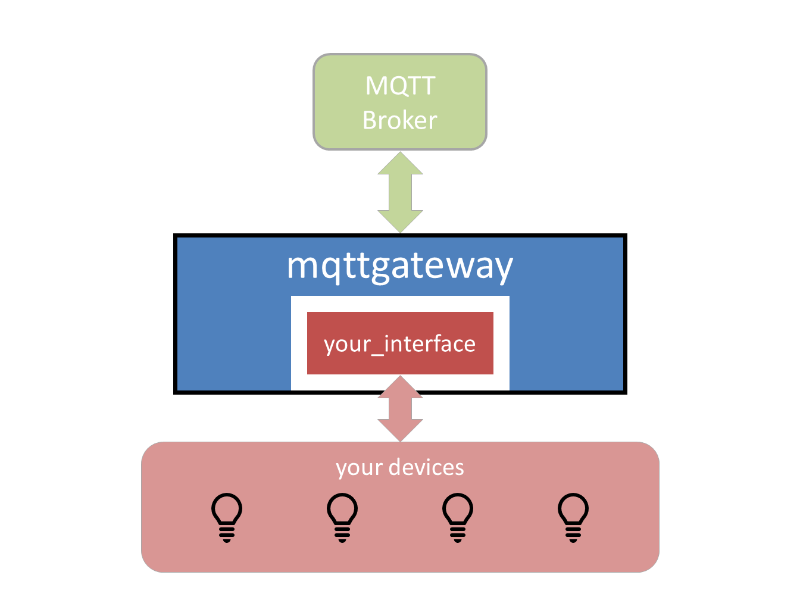

Overview
========

Objective
*********

When setting up an IoT eco-system with a lot of different
devices, it becomes quickly problematic to have them talking to each other
smoothly.  There are a number of choices to make in order for this to happen.
This project assumes that some of those choices have been made: using
`MQTT <http://mqtt.org/>`_ as the messaging transport.
What this project does is helping
in the next set of choices to make: choosing a consistent messaging model
and defining its implementation via a MQTT syntax.

If all the devices involved already communicate via MQTT, this project
can only help with its proposed syntax for MQTT messages.  If some devices
can't communicate natively via MQTT, then this project proposes a
python wrapper that should facilitate writing the gateway
between these devices and the MQTT network.  This gateway can then run
as a service on a machine that is connected to these devices via
whatever interface is available: serial, bluetooth, TCP, or else.

Concepts
********

This project has 2 parts:

1. The definition of the messaging model: the project has its own
   model for messages which is adapted to domestic IoT environments.
   It is an abstraction layer that defines a
   message by many attributes and not only by destination and content.
2. The implementation of this model through a python wrapper
   to communicate via MQTT networks.  The wrapper takes care
   of the addressing syntax and the commands translation via
   mapping data provided by the interface.

For a more in-depth information, go to :doc:`Concepts <concepts>`.

Usage
*****

This project is provided with the core application (the *wrapper*),
and an example interface (the **dummy** interface) that does not
interface with anything but shows how the system works.
The developer can then write its own interface by using the
**dummy** interface as a template.
There are also some already developped interfaces available in the repository.

Installation
************

The installation involves a copy of the repository and the setting of
some configuration parameters.  The only dependency is the
`paho.mqtt <https://pypi.python.org/pypi/paho-mqtt>`_ library.

For the full installation guide, go to :doc:`Installation <installation>`.

Develop your interface
**********************

The interface is made of a class that has to define the 2
methods ``__init__`` (to initialise the interface) and ``loop``
(called periodically to do whatever needs to be done to interact
with the devices), very much like an Arduino script ``setup`` and ``loop`` functions.

The ``loop`` method communicates with the application via 2 lists of
messages (an incoming and an outgoing one).  It reads the incoming list
for commands from the MQTT environment and writes into the outgoing list any
updates on status or commands sent from the devices to the rest of the network.

In the most classic example, a serial interface is the only way to communicate with
the device.  The ``__init__`` method would initialise the serial port and the
``loop`` method would write to the serial port any command received from the
application through the incoming message list, and read the serial port
for messages from the device to be forwarded to the application.

If needed, a mapping JSON file can store the correspondence between the MQTT
keywords and the internal keywords.  This feature is available in case the
MQTT syntax needs to change.

..
	TODO: include a diagram

For a complete guide on how to develop an interface, go to :doc:`Tutorial <tutorial>`.

For a more detailed description of the project, go to :doc:`Project Description <description>`.
