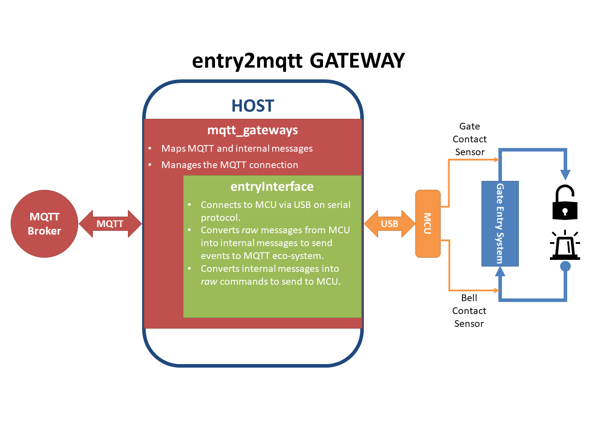

Tutorial
========

Let's go through a practical example, with a very simple protocol.

The Need
********
The gate of the house has an entry system, or intercom. Visitors push the bell button,
and (if all goes well...) after a brief conversation someone let them in by pushing
a gate release button in the house.
Residents have a code to let themselves in: they enter the code and the system releases the
gate.

It would be nice to receive messages about these events, so that other events can be
triggered  (like switching on lights). It would also be nice to trigger the gate
release independently of the entry system.

The Solution
************
We assume the system exposes the electrical contacts that operate the bell and the gate.
A micro-controller (an Arduino for example), can sense the electrical contacts going HIGH
or LOW and can communicate these levels to a Raspberry Pi (or any other computer)
via the USB connection in serial mode for example.
The micro-controller can also be told to switch ON or OFF a relay to release the gate.
We will call ``Entry System`` the combination of the actual entry system with the
micro-controller physical interface.
*Note*: of course a Raspberry Pi could sense directly the electrical contacts without
being shielded by another board. However this use-case suits the tutorial, and is
probably more reliable in the long run.



Implementation
**************
The micro-controller is programmed to communicate with very simple messages for each event:
each message is a pair of numbers (in ASCII), the first indicating which contact the message is about
and the second indicating its state.  With 2 contacts (the bell or the gate), and 2 states (ON or OFF),
there are only 4 messages to deal with: ``10``, ``11``, ``20`` and ``21``.

More precisely, the micro-controller:

- sends a message when a contact goes ON (``11`` or ``21``) and another one when it goes off (``10`` or ``20``)
- can also receive and process messages, but only the one triggering the gate release makes sense (``21``);
  indeed, there is no need to process ``11`` or ``10`` as there is no need to operate the bell via MQTT,
  and there is no need to process the gate release OFF message (``20``) as the micro-controller turns the gate release OFF
  automatically after 3 seconds, for security.

The next step is therefore to code the interface for the computer connected to the micro-controller.
The interface will be *plugged* into our wrapper to make the gateway to MQTT.
Let's call the gateway **entry**.  This will be the label used in all the names in the project (packages,
modules, folders, class, configuration and mapping files).

The map file
************

A good place to start before coding the interface is to write the map file as it forces to list the
functionalities that we want to implement.

Here we want the gateway to broadcast the state changes of the bell (1) and the gate release (2),
as well as open the gate when commanded to (3).  Additionally, we would like the light at the gate to be switched
on when the gate is opened (4) (this could be done in another application that receives the *gate open* broadcast,
but it is useful to show how it can be done inside this gateway).  We therefore have the following *events* to model
with our message characteristics (see :doc:`Concepts <concepts>`).

.. csv-table:: Model
   :header: "Event", "Function", "Gateway", "Location", "Device", "Type", "Action"

   "Bell Ring", "Security", "entry2mqtt", "gate_entry", "Bell", "Status", "BELL_ON"
   "Bell End", "Security", "entry2mqtt", "gate_entry", "Bell", "Status", "BELL_OFF"
   "Gate Open", "Security", "entry2mqtt", "gate_entry", "Gate", "Status", "GATE_OPEN"
   "Gate Close", "Security", "entry2mqtt", "gate_entry", "Gate", "Status or Command", "GATE_CLOSE"
   "Light On", "Lighting", "unknown", "gate_entry", "unknown", "Command", "LIGHT_ON"
   "Light Off", "Lighting", "unknown", "gate_entry", "unknown", "Command", "LIGHT_OFF"

There a few important points to make here:

- The *status* messages sent by this gateway need to be as unequivocal as possible.
  By having the **Gateway** characteristic set to this gateway name should already
  make those messages unique.
- Ideally these messages should also be *overloaded* with information, so that other applications
  have a range of possibilities for topics to subscribe to, depending of which keywords they happen
  to know.  In the example above, specifying the **Device** gives an extra layer of identification
  that is redundant but gives more options for subscription topics.
- The *command* messages need to embody as much information as possible to ensure they reach
  their destination.  However here we will assume that we do not know the **Gateway** or the **Device**
  that operates the lights.  So we only specify the **Function**, the **Location** and the **Action**
  and *hopefully* the application in charge of the lighting will receive the message and execute
  the command.
- by creating this *model*, we are making some choices like defining 2 devices (Bell and Gate) even if
  in this case we could have defined the whole Entry System as the device, and let the actions
  indicate to that device what to do (e.g. ``GATE_OPEN``).  Being more specific is probably a
  better choice.

With this model we can write the map file.  As a reminder, the map file is only there to insulate
the MQTT keywords from our own interface keywords, so that if there are any changes in the MQTT vocabulary,
one only needs to change the map file and not the code.  If this gateway is an addition to an already
existing MQTT eco-system with the same syntax, then some or maybe all of the keywords are already defined,
so the idea of the map is to take those keywords and map them to their corresponding keyword from our
code.  If this gateway is the first one or if some keywords do not exist, this map file will *create*
those new keywords in the MQTT vocabulary, and other applications will need to know about them to be
able to communicate with this gateway.

For the sake of this tutorial, we will use MQTT keywords very similar to the ones used in our model above,
apart from the fact that all letters are lowercase for the MQTT keywords (it's a choice).
The only keyword that we will assume already exists is the location corresponding to the gate. Here we
assume it is already defined as ``frontgarden`` and we will use it for our MQTT equivalent keyword.
We also need to add the subscription that we will need for our gateway.  Here we only need
to receive messages that request the gate to be opened.  The topics to subscribe to have to be
tight enough so that our gateway does not get flooded with messages that are not addressed to it,
but also loose enough to be flexible and not too tied to a rigorous vocabulary.

The map file would then look like this:

.. code-block:: json

	{
		"root": "home",
		"topics": ["home/security/+/frontgarden/+/+/C",
		"home/+/entry2mqtt/+/+/+/C",
		"home/+/+/+/entrysystem/+/C"],
		"function": {
			"map": {
				"security": "Security",
				"lighting": "Lighting"
			},
			"maptype": "strict"
		},
		"gateway": {
			"map": {
				"entry2mqtt": "entry2mqtt"
			},
			"maptype": "strict"
		},
		"location": {
			"map": {
				"frontgarden": "gate_entry"
			},
			"maptype": "strict"
		},
		"device": {
			"map": {
				"gate": "Gate",
				"bell": "Bell"
			},
			"maptype": "strict"
		},
		"source": {
			"maptype": "none"
		},
		"action": {
			"map": {
				"gate_open": "GATE_OPEN",
				"bell_off": "BELL_OFF",
				"bell_on": "BELL_ON",
				"light_off": "LIGHT_OFF",
				"light_on": "LIGHT_ON",
				"gate_close": "GATE_CLOSE"
			},
			"maptype": "strict"
		},
		"argkey": {
			"maptype": "none"
		},
		"argvalue": {
			"maptype": "none"
		}
	}


Enter all those lines in a file named ``entry_map.json`` to be created in the folder ``mqtt_gateways/data``.
That's it for the map file.

The interface
*************

The interface is a Python sub-package of the ``mqtt_gateways`` package.
Let's create it in a new folder ``mqtt_gateways\entry`` with an empty
module ``__init__.py``.
In order not to start from scratch, let's use the ``dummy`` interface as
a template.  Copy ``dummy_interface.py`` from the ``dummy`` package into the
``entry`` package, and change all the ``dummy`` instances into ``entry`` (in the
name of the file as well as inside the file).  The actual interface code has to be in
the class ``entryInterface`` within the module ``entry_interface.py``. It needs to
have at least a constructor ``__init__`` and a method called ``loop``.

The constructor
---------------

The constructor receives 3 arguments: a dictionary of parameters, a pair of message lists,
and the fullpath of the application (which is a non-essential argument but useful for
logging purposes or to find extra files if needed).

The dictionary of parameters is loaded with whatever we put in the configuration file in
the ``[INTERFACE]`` section.  It's up to us to decide what we put in there.  Here we
probably only need a *port* or *device* name in order to open the serial port.  We will
create the configuration file later, but for now we will assume that there will be an
option ``port:whateveritis`` in the ``[INTERFACE]`` section, so we can retrieve it in our code.

The constructor will generally need to keep the message lists locally so that the ``loop``
method can access them, so they will be assigned to local members.

Finally, the constructor will have to initialise the serial communication.

Starting from the template copied above, the only thing to add is the opening of the
serial port.  Add  at the top of the module:

.. code-block:: none

    import serial

(you need to have the PySerial library in your environment), and add the following line inside the constructor:

.. code-block:: none

    self._ser = serial.Serial(port=port, baudrate=9600, timeout=0.01)

The ``port`` variable is already defined in the template (check the code).
The ``baudrate`` has to be the same as the one set by the micro-controller.
Finally the ``timeout`` is fundamental.  It has to be short enough so that
the main loop is not delayed too much.  Without timeout, all the serial
exchanges will be blocking, which obviously can not work in this context as
the ``loop`` method need to be processed as fast as possible.

The ``loop`` method
-------------------

This method will be called by the main loop to let our interface to do
whatever it needs to do.  It needs to execute as fast as possible otherwise
it will block the whole process.  If *really* needed, one could implement separate
threads here, but most of the time this is overkill.

The ``loop`` method should deal with the incoming messages first, execute them if necessary,
then *read* its own system for events and stack them in the outgoing list
if there are any.

Use the code in the template to read the incoming messages list and add this code to it
to deal with the case where the message is a command to open the gate:

.. code-block:: none

    if msg.action == 'GATE_OPEN':
        try:
            self._ser.write('21')
        except serial.SerialException:
            self._logger.info('Problem writing to the serial interface')

Always try to catch any exception that should not disrupt the whole application.  Most of them should not be fatal.

Then read the serial interface to see if there are any events:

.. code-block:: none

    try:
        data = self._ser.read(2)
    except serial.SerialException:
        self._logger.info('Problem reading the serial interface')
        return
    if len(data) < 2:
        return

If there is an event, convert it into an internal message and add it to the outgoing
message list:

.. code-block:: none

    if data[0] == '1':
        device = 'Bell'
        if data[1] == '0':
            action = 'BELL_OFF'
        elif data[1] == '1':
            action = 'BELL_ON'
        else:
            self._logger.info('Unexpected code from Entry System')
            return
    elif data[0] == '2':
        device = 'Gate'
        if data[1] == '0':
            action = 'GATE_CLOSE'
        elif data[1] == '1':
            action = 'GATE_OPEN'
        else:
            self._logger.info('Unexpected code from Entry System')
            return
    msg = internalMsg(iscmd=False, # it is a status message
                      function='Security',
                      gateway='entry2mqtt',
                      location='gate_entry',
                      device=device,
                      action=action)
    self._msgl_out.append(msg)

Finally, let's send a command to switch on the light in case the gate was opened:

.. code-block:: none

    if data == '21':
        msg = internalMsg(iscmd=True,
                          function='Lighting',
                          location='gate_entry',
                          action='LIGHT_ON')
        self._msgl_out.append(msg)

That's it. Of course one can improve the functionality by putting a timer
to switch off the lights after a while for example.

Other coding strategies
-----------------------

The class can be defined as a subclass of Serial in this case.
It might be more *elegant* and it reflects well what that is, i.e. a higher level
serial interface to a specific device.

The conversion of the raw messages from the serial interface into internal messages
can be done through lookup tables instead of nested *ifs*, in the same vein as the map file
converts MQTT keywords into internal keywords.
However that conversion can be more complex to represent, because, for example,
a single internal message might need multiple events or commands to be sent to the interface.
In this case it is quite simple, and we could have defined a dictionary to help the conversion.

Wrapping it all up
******************

Once the interface is defined, all is left to do is to create the launch script and
the configuration file.  Those 2 steps are easy using the templates.

Copy the **dummy** project launch script ``dummy2mqtt.py`` and paste it
into the ``entry`` directory.
Change every instance of ``dummy`` into ``entry```, as in the interface steps.
If all the naming steps have been respected, the script ``entry2mqtt.py`` just created
should work.

Go to the ``mqtt_gateways/data`` directory, copy the configuration file ``dummy2mqtt.conf``
and paste it in the same folder with the name ``entry2mqtt.py``.
Edit the file and enter the ``port`` option under the ``[INTERFACE]`` section:

.. code-block:: none

   [INTERFACE]
   port=/dev/ttyACM0

Obviously input whatever is the correct name of the port, the one shown is generally the one
to use on a Raspberry Pi for the USB serial connection.  If you are on Windows, your port
should be something like ``COM3``.

If you went through the :doc:`installation <installation>` process the MQTT parameters
should already be set up, otherwise do so.  Other parameters can be left as they are.
Check the :doc:`configuration <configuration>` guide for more details.

Launch
******

To launch the gateway, goto the *root* directory ``mqtt_gateways`` (the first one).  This
should be the working directory from where the following command should be run:

.. code-block:: none

    python -m mqtt_gateways.entry.entry2mqtt ../data

On Windows, use ``..\data`` as argument.

Done!
